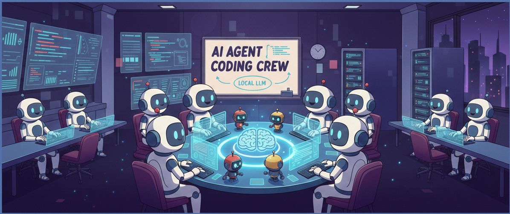

# Coding Crew

A local AI coding agent swarm exposed as an MCP server for the [Continue](https://continue.dev) VS Code extension. It uses [CrewAI](https://www.crewai.com/) to orchestrate four specialised agents — Architect, Coder, Reviewer, and Tester — all powered by a local LLM served via [Ollama](https://ollama.com) or [vLLM](https://github.com/vllm-project/vllm).

Everything runs on your machine. No API keys, no cloud calls, no data leaving your network.

## Prerequisites

- Python 3.10+
- VS Code
- **One of:**
  - Ollama (easiest) — installed automatically by the setup script
  - vLLM (best performance) — requires a CUDA-capable GPU

## Quick Start

```bash
git clone <repo-url> && cd coding_crew

# Ollama (default)
./configure_swarm.sh \
  -p 11434 \
  -m qwen2.5-coder:14b \
  -d ~/my-project

# vLLM
./configure_swarm.sh \
  -p 8000 \
  -m Qwen/Qwen2.5-Coder-14B-Instruct-AWQ \
  -d ~/my-project \
  -b vllm
```

Then start the LLM server:

```bash
~/my-project/start_swarm.sh
```

Open VS Code, press **Ctrl+L**, and start chatting with Continue.

## Setup Script

`configure_swarm.sh` automates the entire setup in six steps:

| Step | What it does |
|------|-------------|
| 1 | Creates a Python virtual environment at `DIR/.venv` and installs all dependencies |
| 2 | Installs the LLM backend (Ollama or vLLM) and pulls/downloads the model |
| 3 | Installs the Continue VS Code extension |
| 4 | Substitutes your port, model, and directory into `config.yaml` and copies `swarm_mcp_server.py` to the project directory |
| 5 | Installs the generated `config.yaml` into `~/.continue/config.yaml` (backs up any existing config) |
| 6 | Generates a `start_swarm.sh` startup script tailored to your chosen backend |

### Options

```
Usage: ./configure_swarm.sh -p PORT -m MODEL -d DIR [-b BACKEND]

Required:
  -p PORT      Port for the LLM API server (e.g. 8000)
  -m MODEL     Model identifier
                 vLLM:   Qwen/Qwen2.5-Coder-14B-Instruct-AWQ
                 Ollama: qwen2.5-coder:14b
  -d DIR       Absolute path to the project working directory

Optional:
  -b BACKEND   LLM backend: "vllm" or "ollama" (default: ollama)
  -h           Show this help
```

## Architecture

```
VS Code + Continue
       |
       | (MCP protocol over stdio)
       v
swarm_mcp_server.py
       |
       | (CrewAI orchestration)
       v
┌─────────────┬───────────────┬──────────────┬─────────────┐
│  Architect  │    Coder      │   Reviewer   │   Tester    │
└──────┬──────┴───────┬───────┴──────┬───────┴──────┬──────┘
       │              │              │              │
       └──────────────┴──────────────┴──────────────┘
                          |
                    Local LLM API
                  (Ollama or vLLM)
```

### Agents

| Agent | Role | Description |
|-------|------|-------------|
| **Architect** | Software Architect | Designs clean, scalable architecture. Can delegate sub-tasks to other agents. |
| **Coder** | Senior Developer | Writes high-quality, efficient code based on the design. |
| **Reviewer** | Code Reviewer | Reviews code for bugs, security issues, and best-practice violations. |
| **Tester** | QA Engineer | Writes comprehensive test suites including unit tests and edge cases. |

## MCP Server Tools

The MCP server exposes four tools that Continue can call during a conversation. You can invoke them naturally by describing what you need — Continue will pick the right tool.

### `full_coding_task`

Runs the complete agent pipeline: Architect designs, Coder implements, Reviewer audits, Tester writes tests. Tasks execute sequentially so each agent builds on the previous agent's output.

| Parameter | Required | Description |
|-----------|----------|-------------|
| `task_description` | yes | Detailed description of what you want to build |
| `context` | no | Additional context: existing code, requirements, constraints |

**When to use:** New features, complex implementations, or when you want a thorough end-to-end solution with design, code, review, and tests.

**Example prompt in Continue:**
> Use the coding swarm to build a REST API endpoint for user registration with validation, error handling, and tests.

### `quick_code`

Uses only the Coder agent for fast, focused code generation. Skips architecture design, review, and testing.

| Parameter | Required | Description |
|-----------|----------|-------------|
| `task_description` | yes | What code to generate |
| `context` | no | Any relevant context or requirements |

**When to use:** Small functions, quick fixes, utility code, or when you already know the design and just need implementation.

**Example prompt in Continue:**
> Quick code a Python function that converts a nested dictionary to a flat dictionary with dot-separated keys.

### `review_code`

Sends code to the Reviewer agent for analysis. Returns findings on bugs, security vulnerabilities, performance issues, and style improvements.

| Parameter | Required | Description |
|-----------|----------|-------------|
| `code` | yes | The code to review |
| `language` | no | Programming language (default: `python`) |

**When to use:** Before merging code, auditing existing code, or when you want a second opinion on a tricky implementation.

**Example prompt in Continue:**
> Review this code for security issues:
> ```python
> def login(username, password):
>     query = f"SELECT * FROM users WHERE name='{username}' AND pass='{password}'"
>     return db.execute(query)
> ```

### `write_tests`

Sends code to the Tester agent to generate a comprehensive test suite.

| Parameter | Required | Description |
|-----------|----------|-------------|
| `code` | yes | The code to write tests for |
| `language` | no | Programming language (default: `python`) |

**When to use:** When you have working code and need test coverage, or when you want to see edge cases you may have missed.

**Example prompt in Continue:**
> Write tests for this function:
> ```python
> def merge_sorted(a, b):
>     result = []
>     i = j = 0
>     while i < len(a) and j < len(b):
>         if a[i] <= b[j]:
>             result.append(a[i]); i += 1
>         else:
>             result.append(b[j]); j += 1
>     return result + a[i:] + b[j:]
> ```

## Configuration

### Environment Variables

The MCP server reads its configuration from environment variables (set automatically by Continue via `config.yaml`):

| Variable | Default | Description |
|----------|---------|-------------|
| `OPENAI_API_BASE` | `http://localhost:8000/v1` | Base URL of the LLM API |
| `OPENAI_API_KEY` | `dummy-key` | API key (not used by local backends, but required by the client) |
| `OPENAI_MODEL_NAME` | `Qwen/Qwen2.5-Coder-14B-Instruct-AWQ` | Model identifier |

### Files

| File | Purpose |
|------|---------|
| `configure_swarm.sh` | One-time setup script |
| `swarm_mcp_server.py` | MCP server with the agent swarm |
| `config.yaml` | Continue configuration template (placeholders are filled by the setup script) |
| `start_swarm.sh` | Generated startup script for the LLM server (created by setup) |
| `dashboard.py` | Rich-based live monitoring dashboard |

## Dashboard

`dashboard.py` is a terminal dashboard built with [Rich](https://github.com/Textualize/rich) that shows live metrics in a single terminal — no tmux required.

```
┌─────────────── GPU ───────────────┬────── vLLM / Ollama Server ──────┐
│                                   │                                  │
│  GPU   NVIDIA RTX 5080           │  Status        ● Online          │
│  Util  ████████░░░░░░░░  42.0%   │  Prompt tokens     12,345       │
│  VRAM  ██████████░░░░░░  61.2%   │  Gen tokens        6,789        │
│        9,812 / 16,384 MiB        │  Requests running  2            │
│  Temp  62°C                       │  Avg TTFT          0.142 s      │
│  Power 185 / 250 W                │  Token rate        38.7 tok/s   │
│                                   │                                  │
├──────────────── MCP Server Log ──────────────────────────────────────┤
│ 2025-06-01 10:23:45 - INFO - Tool called: full_coding_task          │
│ 2025-06-01 10:23:46 - INFO - Executing full task: Build a REST...   │
│ 2025-06-01 10:24:12 - INFO - Task completed successfully            │
└──────────────────────────────────────────────────────────────────────┘
```

### What it monitors

| Panel | Source | Metrics |
|-------|--------|---------|
| **GPU** | `nvidia-smi` | Utilization %, VRAM used/total, temperature, power draw |
| **vLLM Server** | vLLM `/metrics` (Prometheus) | Prompt/generated token totals, requests running/waiting, avg time-to-first-token, avg time-per-output-token, token generation rate (tok/s) |
| **Ollama Server** | Ollama `/api/ps` | Loaded models, model size, VRAM usage |
| **MCP Server Log** | `/tmp/swarm_mcp_server.log` | Last 12 log lines, colour-coded by severity |

### Usage

```bash
# Use the project venv (rich is already installed)
.venv/bin/python dashboard.py --port 8000 --backend vllm
.venv/bin/python dashboard.py --port 11434 --backend ollama
```

You can also set `SWARM_PORT` and `SWARM_BACKEND` environment variables instead of flags. Press `Ctrl+C` to exit.

## Logs

The MCP server logs to `/tmp/swarm_mcp_server.log`. Tail it to debug issues:

```bash
tail -f /tmp/swarm_mcp_server.log
```

## Troubleshooting

**Continue doesn't show the swarm tools**
- Make sure `~/.continue/config.yaml` exists and has the `mcpServers` section with the correct paths.
- Check the MCP log: `tail /tmp/swarm_mcp_server.log`

**"Connection refused" errors**
- Ensure the LLM server is running: `curl http://localhost:<port>/v1/models`
- Check that the port in `config.yaml` matches the port your LLM backend is listening on.

**Model not found**
- Ollama: run `ollama list` to see downloaded models.
- vLLM: check that the HuggingFace model name is correct and has been downloaded.

**Slow first response**
- The first request may take longer as the model loads into GPU memory. Subsequent requests will be faster.
